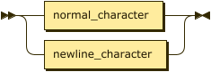

<div style="background-color: white; color: black; padding: 1em;">

**astn_document:**


```
astn_document
         ::= ( '!' header )? content
```

**header:**


```
header   ::= value
```

referenced by:

* astn_document

**content:**


```
content  ::= value
```

referenced by:

* astn_document

**value:**


```
value    ::= concise_group
           | dictionary
           | include
           | list
           | '~'
           | set_optional_value
           | string
           | tagged_value
           | verbose_group
```

referenced by:

* content
* elements
* header
* include
* key_value_pairs
* set_optional_value
* tagged_value

**concise_group:**


```
concise_group
         ::= '<' elements '>'
```

referenced by:

* value

**dictionary:**


```
dictionary
         ::= '{' key_value_pairs '}'
```

referenced by:

* value

**include:**


```
include  ::= '@' value
```

referenced by:

* value

**list:**


```
list     ::= '[' elements ']'
```

referenced by:

* value

**set_optional_value:**


```
set_optional_value
         ::= '*' value
```

referenced by:

* value

**string:**


```
string   ::= quoted_string
           | apostrophed_string
           | backticked_string
           | undelimited_string
```

referenced by:

* key_value_pairs
* tagged_value
* value

**tagged_value:**


```
tagged_value
         ::= '|' string value
```

referenced by:

* value

**verbose_group:**


```
verbose_group
         ::= '(' key_value_pairs ')'
```

referenced by:

* value

**elements:**


```
elements ::= ( value ','? )*
```

referenced by:

* concise_group
* list

**key_value_pairs:**


```
key_value_pairs
         ::= ( string ( ':' value )? ','? )*
```

referenced by:

* dictionary
* verbose_group

**ignorable:**


```
ignorable
         ::= whitespace
           | comment
          /* ws: definition */
```

**quoted_string:**


```
quoted_string
         ::= '"' ( string_content_character - '"' | newline_character )* '"'
```

referenced by:

* string

**apostrophed_string:**


```
apostrophed_string
         ::= "'" ( string_content_character - "'" )* "'"
```

referenced by:

* string

**backticked_string:**


```
backticked_string
         ::= '`' ( string_content_character - '`' )* '`'
```

referenced by:

* string

**undelimited_string:**


```
undelimited_string
         ::= ( normal_character - ( '{' | '}' | '<' | '>' '(' | ')' '[' | ']' | '!' | '*' | ',' | '~' | ':' | '@'
                  | '|' | "'" | '"' | '`' | '/' | ' ' | '\t' )? )*
```

referenced by:

* string

**string_content_character:**


```
string_content_character
         ::= normal_character
           | escaped_character
```

referenced by:

* apostrophed_string
* backticked_string
* quoted_string

**normal_character:**


```
normal_character
         ::= [#x20-#xD7FF#xE000-#xFFFD#x10000-#x10FFFF]?
```

referenced by:

* line_comment
* normal_or_newline_character
* string_content_character
* undelimited_string

**escaped_character:**


```
escaped_character
         ::= '\"'
           | '\`'
           | "\'"
           | '\\'
           | '\/'
           | '\b'
           | '\f'
           | '\n'
           | '\r'
           | '\t'
           | '\u' four_hexadecimal_digits
```

referenced by:

* string_content_character

**newline_character:**


```
newline_character
         ::= [#xA#xD]
```

referenced by:

* normal_or_newline_character
* quoted_string

**normal_or_newline_character:**



```
normal_or_newline_character
         ::= normal_character
           | newline_character
```

referenced by:

* traditional_comment

**comment:**


```
comment  ::= traditional_comment
           | line_comment
```

referenced by:

* ignorable

**traditional_comment:**


```
traditional_comment
         ::= '/*' ( normal_or_newline_character* - ( normal_or_newline_character* '*/' normal_or_newline_character* ) ) '*/'
```

referenced by:

* comment

**line_comment:**


```
line_comment
         ::= '//' normal_character*
```

referenced by:

* comment

**four_hexadecimal_digits:**


```
four_hexadecimal_digits
         ::= hexadecimal_digit hexadecimal_digit hexadecimal_digit hexadecimal_digit
```

referenced by:

* escaped_character

**hexadecimal_digit:**


```
hexadecimal_digit
         ::= [0-9A-Fa-f]
```

referenced by:

* four_hexadecimal_digits

**whitespace:**


```
whitespace
         ::= [#x9#xA#xD#x20]+
```

referenced by:

* ignorable

## 
 <sup>generated by [RR - Railroad Diagram Generator][RR]</sup>

[RR]: https://www.bottlecaps.de/rr/ui

</div>